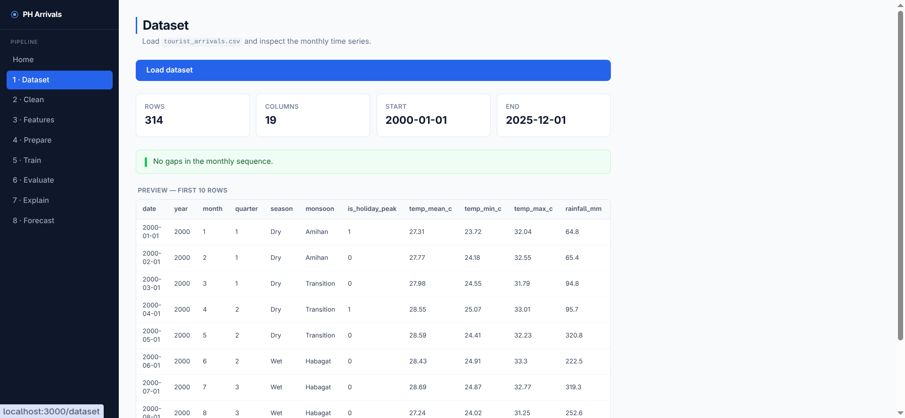
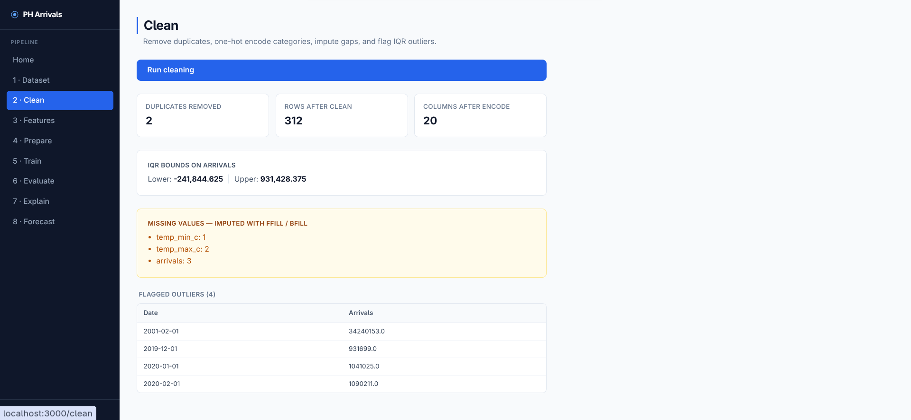
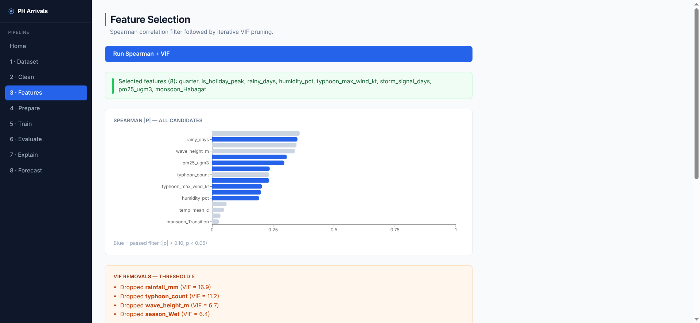
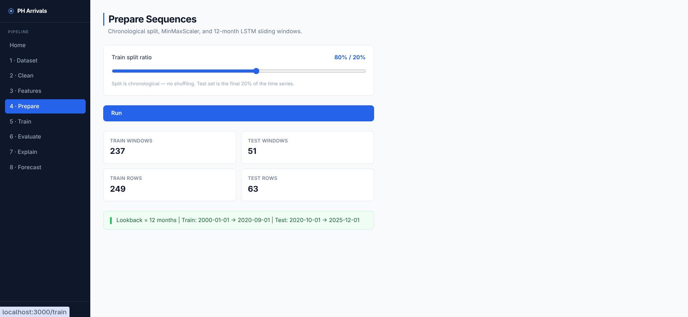
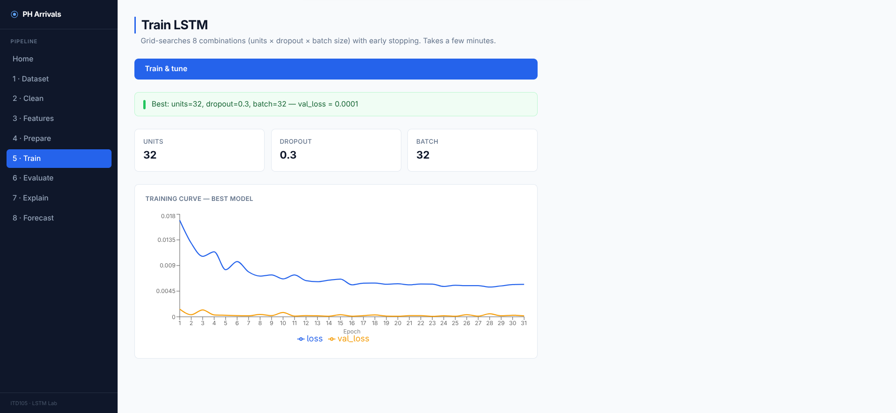
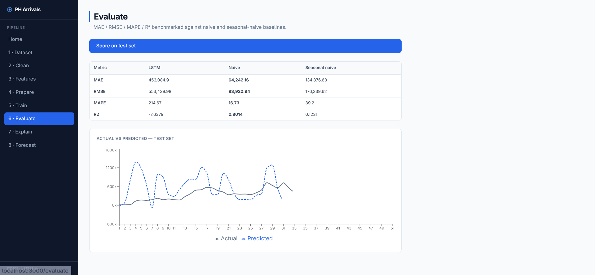
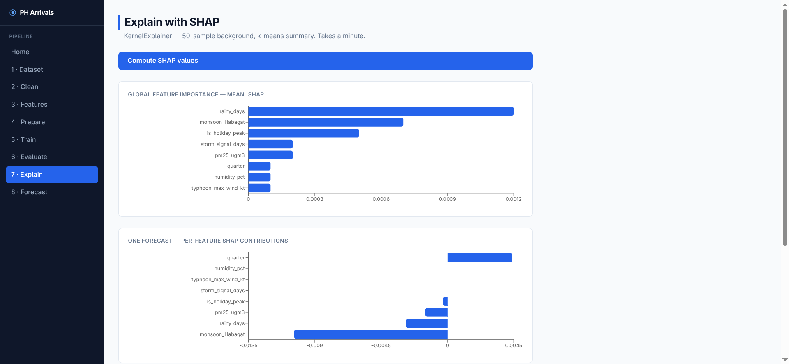
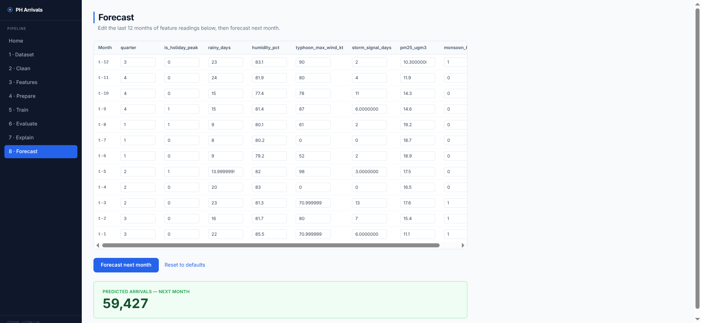

# Philippine Tourist Arrivals – Forecasting Lab (Advanced)

A FastAPI + Next.js rebuild of the Lab1 Streamlit app. The same pipeline logic (clean → features → prepare → train → evaluate → explain → forecast) runs as a REST API; a Next.js frontend calls it and renders the UI. Built for ITD105.

## Screenshots

| Step | Preview |
|------|---------|
| 1. Dataset |  |
| 2. Clean |  |
| 3. Features |  |
| 4. Prepare |  |
| 5. Train |  |
| 6. Evaluate |  |
| 7. Explain |  |
| 8. Forecast |  |

## What it does

The app has eight pages that must be run in order. Each page calls the corresponding API endpoint, which depends on the previous step having been run in the same server session.

| Step | Endpoint | What happens |
|------|----------|--------------|
| 1 | `POST /dataset/load` | Loads `tourist_arrivals.csv`, reports row/column counts, checks for gaps in the monthly sequence |
| 2 | `POST /clean/run` | Removes duplicate dates, one-hot encodes season/monsoon columns, imputes missing values with forward/backward fill, flags IQR outliers on arrivals |
| 3 | `POST /features/run` | Runs Spearman correlation filter (\|rho\| > 0.10, p < 0.05), then iterative VIF pruning (threshold 5) to select a final feature set |
| 4 | `POST /prepare/run` | Splits data chronologically (no shuffling), fits MinMaxScaler on the training set only, builds 12-month lookback sequences for both splits |
| 5 | `POST /train/run` | Grid-searches over LSTM units (32, 64), dropout (0.1, 0.3), and batch size (16, 32) using early stopping; keeps the best checkpoint by validation loss |
| 6 | `POST /evaluate/run` | Scores the LSTM on the held-out test set against two baselines: naive (previous month) and seasonal naive (same month one year prior), reporting MAE, RMSE, MAPE, and R2 |
| 7 | `POST /explain/run` | Computes SHAP values via KernelExplainer (black-box, 50-sample background, k-means summary) and returns global feature importance, per-forecast contributions, and a dependence plot for the top feature |
| 8 | `GET /forecast/default-window` + `POST /forecast/run` | Fetches the last 12 months of feature readings and predicts next month's arrivals |

## Dataset

`Lab1/data/tourist_arrivals.csv` contains monthly records from January 2000 onward. Each row covers one calendar month with the following columns:

- **Temporal:** `date`, `year`, `month`, `quarter`
- **Seasonal:** `season` (Dry/Wet), `monsoon` (Amihan/Habagat/Transition)
- **Calendar flag:** `is_holiday_peak`
- **Weather:** `temp_mean_c`, `temp_min_c`, `temp_max_c`, `rainfall_mm`, `rainy_days`, `humidity_pct`
- **Typhoon:** `typhoon_count`, `typhoon_max_wind_kt`, `storm_signal_days`
- **Air/sea:** `pm25_ugm3`, `wave_height_m`
- **Target:** `arrivals`

## Project structure

```
Lab1-advanced/
├── backend/
│   ├── main.py            — FastAPI app, CORS, router registration
│   ├── state.py           — shared in-memory pipeline state (replaces st.session_state)
│   ├── requirements.txt
│   ├── data/              — copy of tourist_arrivals.csv from Lab1/data/
│   └── routers/
│       ├── dataset.py     → POST /dataset/load
│       ├── clean.py       → POST /clean/run
│       ├── features.py    → POST /features/run
│       ├── prepare.py     → POST /prepare/run
│       ├── train.py       → POST /train/run
│       ├── evaluate.py    → POST /evaluate/run
│       ├── explain.py     → POST /explain/run
│       └── forecast.py    → GET  /forecast/default-window
│                          → POST /forecast/run
└── frontend/
    ├── package.json       — Next.js 14, Recharts, Tailwind
    ├── lib/api.ts         — typed fetch helpers for every endpoint
    ├── components/        — Sidebar, RunButton, Alert
    └── app/               — one page per pipeline step + home
```

## Setup & Running

Python 3.10+ and Node.js 18+ recommended.

### First-Time Setup

#### 1. Copy the dataset

```bash
mkdir -p Lab1-advanced/backend/data
cp Lab1/data/tourist_arrivals.csv Lab1-advanced/backend/data/
```

#### 2. Setup backend virtual environment

```bash
cd Lab1-advanced/backend
python -m venv venv
source venv/bin/activate
pip install -r requirements.txt
```

#### 3. Install frontend dependencies

In a separate terminal:

```bash
cd Lab1-advanced/frontend
npm install
```

---

### Running the Application

For subsequent runs (or after initial setup), start both servers in separate terminals:

#### Terminal 1 — Backend

Activate the existing virtual environment and start the API server:

```bash
cd Lab1-advanced/backend
source venv/bin/activate
uvicorn main:app --reload --port 8000
```

- API server: `http://localhost:8000`
- Interactive API docs (auto-generated by FastAPI): `http://localhost:8000/docs`

#### Terminal 2 — Frontend

Start the Next.js dev server:

```bash
cd Lab1-advanced/frontend
npm run dev
```

- Web UI: `http://localhost:3000`

> **Note:** Keep both terminals running at the same time. Open `http://localhost:3000` in your browser and follow the sidebar pages in order.

## How it maps to the Streamlit version

| Streamlit page | FastAPI endpoint | Next.js page |
|---|---|---|
| `1_Dataset.py` | `POST /dataset/load` | `/dataset` |
| `2_Clean.py` | `POST /clean/run` | `/clean` |
| `3_Features.py` | `POST /features/run` | `/features` |
| `4_Prepare.py` | `POST /prepare/run` | `/prepare` |
| `5_Train.py` | `POST /train/run` | `/train` |
| `6_Evaluate.py` | `POST /evaluate/run` | `/evaluate` |
| `7_Explain.py` | `POST /explain/run` | `/explain` |
| `8_Forecast.py` | `GET /forecast/default-window` + `POST /forecast/run` | `/forecast` |

`st.session_state` → `backend/state.py` (shared in-memory dict, single-user dev).

## Dependencies

### Backend

| Package | Purpose |
|---------|---------|
| `fastapi` | REST API framework |
| `uvicorn[standard]` | ASGI server |
| `pandas` | Data loading and cleaning |
| `numpy` | Array operations and sequence building |
| `scipy` | Spearman correlation |
| `statsmodels` | Variance inflation factor |
| `scikit-learn` | MinMaxScaler |
| `tensorflow` | LSTM model (Keras API) |
| `shap` | Model explanation via KernelExplainer |
| `python-multipart` | File upload support for FastAPI |

### Frontend

| Package | Purpose |
|---------|---------|
| `next` | React framework and file-based routing |
| `react` / `react-dom` | UI library |
| `recharts` | Charts for metrics and SHAP plots |
| `tailwindcss` | Utility-first styling |
| `typescript` | Type safety across the frontend |

## Notes

- The scaler is fit on training data only. Applying it to the test split before fitting would be data leakage. The Prepare endpoint makes this explicit.
- The LSTM grid search runs up to 8 combinations (2 units x 2 dropout x 2 batch sizes) with early stopping at patience 8 over a maximum of 100 epochs. Training time depends on hardware.
- The SHAP step uses KernelExplainer rather than DeepExplainer because the TensorFlow version in use does not register the custom gradients required for LSTM internals.
- Pipeline state is held in memory on the server. Restarting the backend clears all state; start from step 1 again.
- CORS is configured to allow `http://localhost:3000` only. If you change the frontend port, update `allow_origins` in `backend/main.py`.
